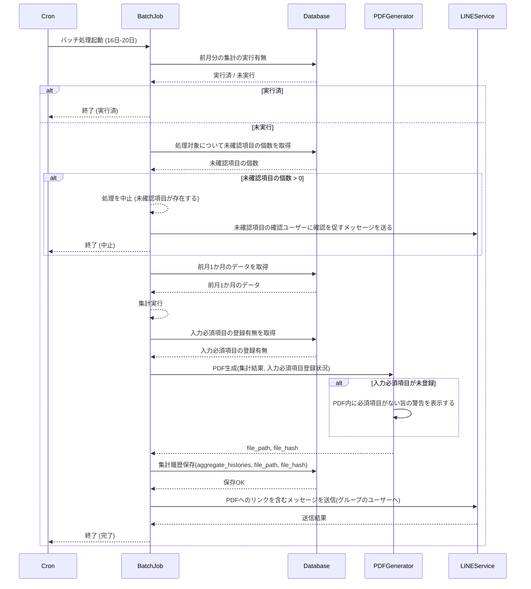

# Batch 1 月次割り勘集計バッチ

## 概要

毎月実行する処理
前月の収支状況を集計しPDFを作成, 作成完了したらLINE通知を送信する
未確認項目があって集計できない場合もLINE通知を送信する

## シーケンス図



## 未確認項目がある場合のメッセージサンプル

```txt
次の項目が未確認です。
確認お願いします。
- xxxx (https://example.com/confirm/xxxx)
- yyyy (https://example.com/confirm/yyyy)
- zzzz (https://example.com/confirm/zzzz)

確認: https://example.com/confirm
閲覧: https://example.com/list
```

## 正常に生成できた場合のメッセージサンプル

```txt
〇月の集計が完了しました。
合計支出額: 〇円
あなたの支払額: 〇円

集計結果詳細: https://example.com/aggregate/files/path-to/file.pdf
```

## 入力必須項目が未登録だったが、集計が完了した場合のメッセージサンプル

```txt
〇月の集計が完了しました。
合計支出額: 〇円
あなたの支払額: 〇円

* 未入力項目がありました。修正する場合はこちら (https://example.com/register)

集計結果詳細: https://example.com/aggregate/files/path-to/file.pdf
```

## cron サンプル（例）

- 毎月16〜20日の20:00に実行（Linux cron形式）:
  `0 20 16-20 * * /path/to/run-batch.sh`
- 20日のみ実行（強制確認を伴う実行を別コマンドで分けたい場合）:
  `0 20 20 * * /path/to/run-batch-with-force-confirm.sh`

## PDF出力について

- 支出の合計金額, ユーザー1への請求額, ユーザー2への請求額を計算する
- 各列に表示するのは、支出額, 支出割合を計算した請求額
- 強制的に確認済に変更されていた場合はその旨も表示する
- [出力サンプル](../samples/invoice_2026-01.pdf)を参考に計算する。

## DB参照

- テーブル定義・関連情報は [db.md](db.md) を参照
