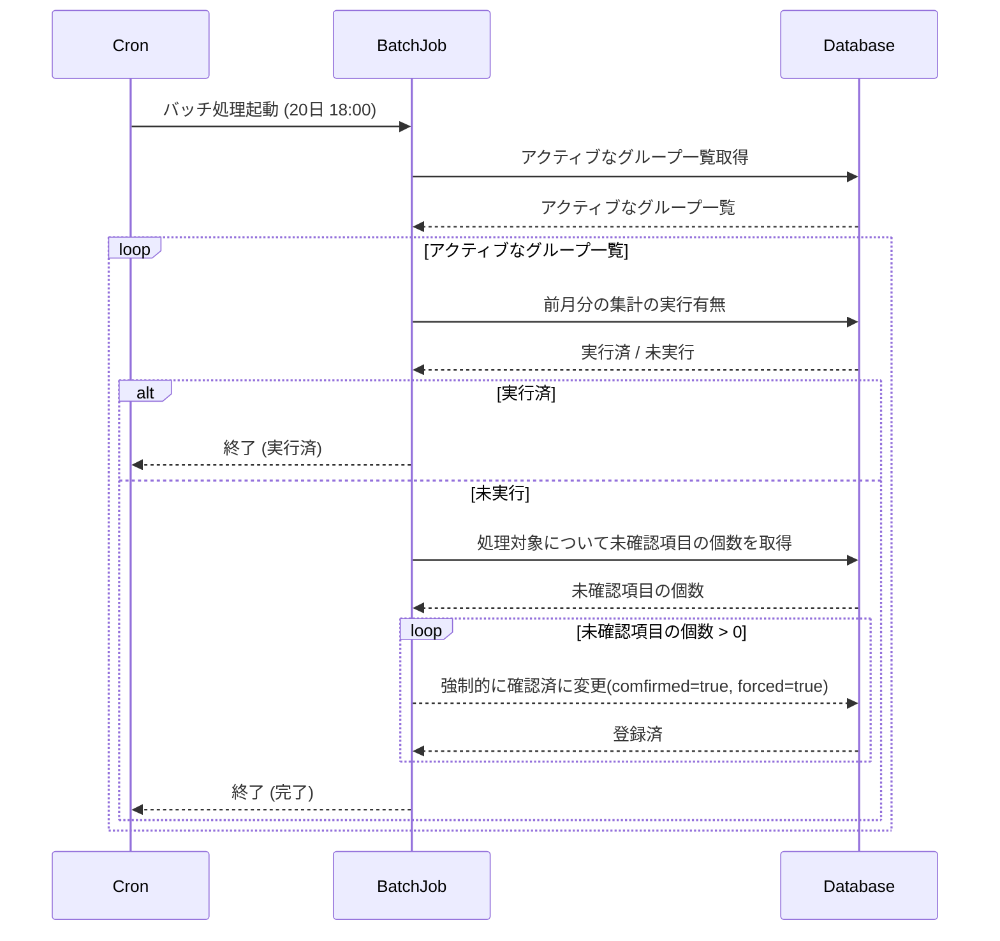

# Batch 2 強制確認バッチ

## 概要

毎月実行する処理
未確認項目を強制的に確認済に変更する

## シーケンス図

## cron サンプル（例）

- 毎月16〜20日の20:00に実行（Linux cron形式）:
  `0 20 16-20 * * /path/to/run-batch.sh`
- 20日のみ実行（強制確認を伴う実行を別コマンドで分けたい場合）:
  `0 20 20 * * /path/to/run-batch-with-force-confirm.sh`

## PDF出力について

- 支出の合計金額, ユーザー1への請求額, ユーザー2への請求額を計算する
- 各列に表示するのは、支出額, 支出割合を計算した請求額
- [出力サンプル](../samples/invoice_2026-01.pdf)を参考に計算する。

## DB参照

- テーブル定義・関連情報は [db.md](db.md) を参照
