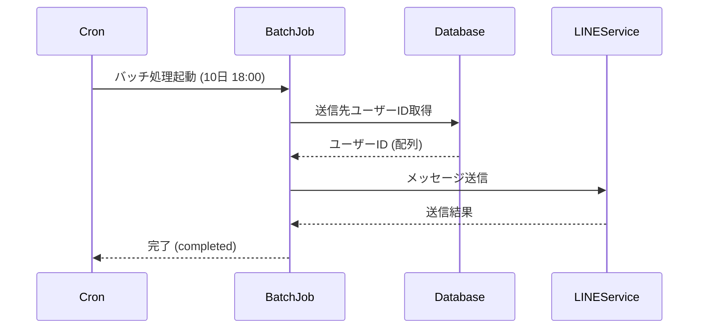

# Batch 3 月次入力催促バッチ

## 概要

毎月10日の18時に実行する
DBに登録された宛先に入力を催促するLINEメッセージを送信する
メッセージには入力ページ, 一覧ページへのリンクを含める

## シーケンス図



## メッセージ例

```txt
まもなく〇月の集計が行われます。
未登録の支出がある場合は登録してください。
登録: https://example.com/register
閲覧: https://example.com/list
```

## cron サンプル（例）

- 毎月10日の18:00に実行（Linux cron形式）:
  `0 18 10 * * /path/to/run-batch.sh`

## ユーザーID取得クエリサンプル

```sql
-- 有効なグループに紐づくユーザーIDを取得
SELECT user_id_1, user_id_2 FROM user.v_active_groups;

-- LINEのユーザーIDを取得
SELECT distinct line_user_id FROM user.user_contacts 
WHERE user_id in ('user_id_1', 'user_id_2'); -- 取得したユーザーIDで検索
```

## LINEメッセージ送信サンプル

```sh
curl -v -X POST https://api.line.me/v2/bot/message/push \
-H 'Content-Type: application/json' \
-H 'Authorization: Bearer <MessagingAPI認証トークン>' \
-d '{
    "to": "<宛先ユーザーID>",
    "messages":[
        {
            "type":"text",
            "text":"<メッセージ>"
        }
    ]
}'
```

## DB参照

- テーブル定義・関連情報は [db.md](db.md) を参照
