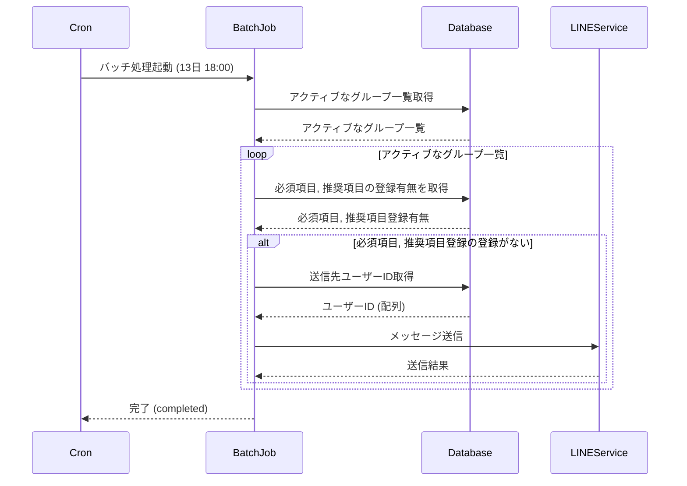

# Batch 4 月次未入力警告バッチ

## 概要

毎月13日の18時に実行する
DBに登録された宛先に入力を催促するLINEメッセージを送信する
メッセージには入力ページ, 一覧ページへのリンクを含める

## シーケンス図



## メッセージ例

```txt
(エラー)次の必須項目が未登録です。
- xxxx
- yyyy
(警告)次の推奨項目が未登録です。
- zzzz

〇日までに登録を行ってください。
登録: https://example.com/register
閲覧: https://example.com/list
```

## cron サンプル（例）

- 毎月13日の18:00に実行（Linux cron形式）:
  `0 18 13 * * /path/to/run-batch.sh`

## クエリサンプル

```sql
-- 有効なグループのIDを取得
SELECT group_id FROM user.v_active_groups;

-- 未登録の必須項目, 通知送信先を取得する
SELECT rule_name, rule_id, behavior_code, notify_to
FROM expense.expense_rules
LEFT JOIN expense.expense_bodies eb using(rule_id)
LEFT JOIN (
    SELECT expense_id FROM expense.expense_headers using(expense_id)
    WHERE expense_date between '2026-01-01' and '2026-02-01' LIMIT 1
    ) eh
WHERE eb.item_id is null
AND er.group_id = 'グループID';
```

## LINEメッセージ送信サンプル

```sh
curl -v -X POST https://api.line.me/v2/bot/message/push \
-H 'Content-Type: application/json' \
-H 'Authorization: Bearer <MessagingAPI認証トークン>' \
-d '{
    "to": "<宛先ユーザーID>",
    "messages":[
        {
            "type":"text",
            "text":"<メッセージ>"
        }
    ]
}'
```

## DB参照

- テーブル定義・関連情報は [db.md](db.md) を参照
